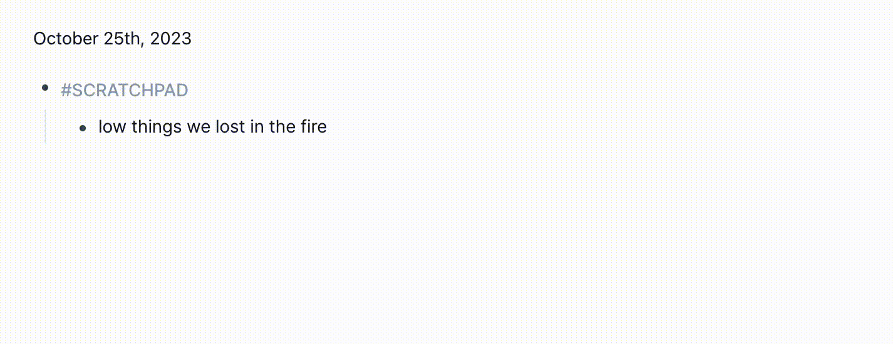

# Logseq Discogs Plugin

https://github.com/axelav/logseq-plugin-discogs

Query the [discogs.com](https://discogs.com) API for album data and write it to
your logseq graph using a slash command or context menu.

## Usage

- Add some search terms to a block, eg: "low things we lost in the fire".
- Use the "Query discogs.com API" slash command or select "Query discogs.com
  API" from the block's context menu (right-click the block bullet).
